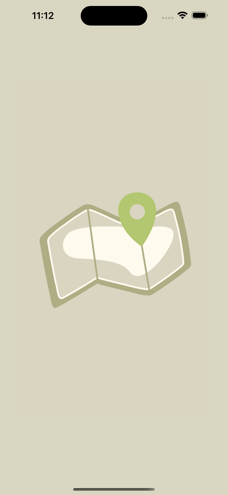
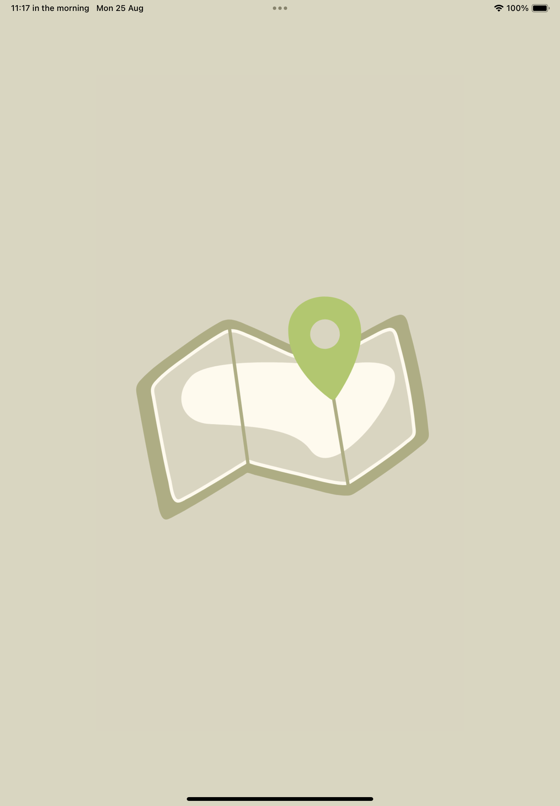
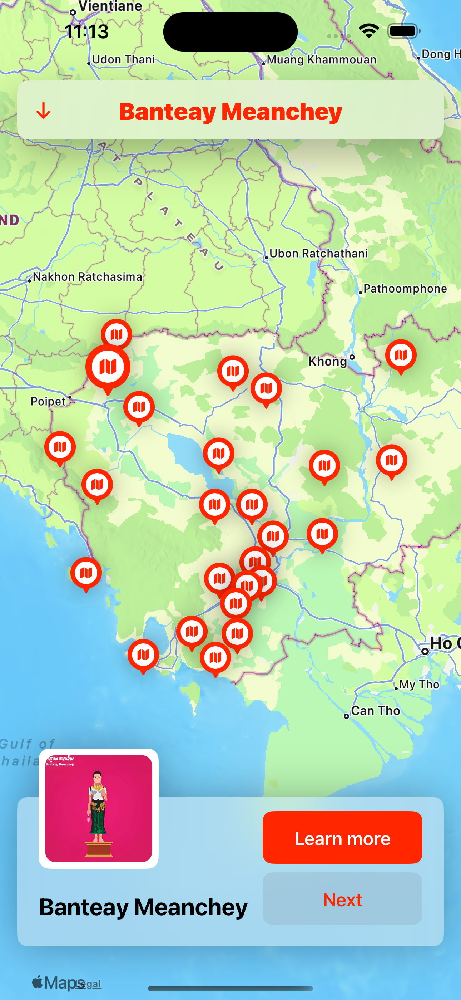
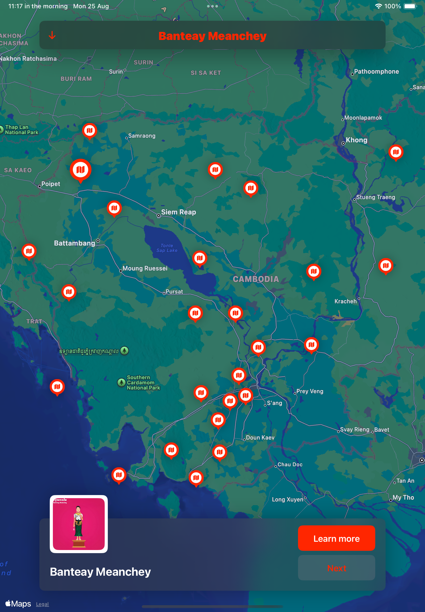
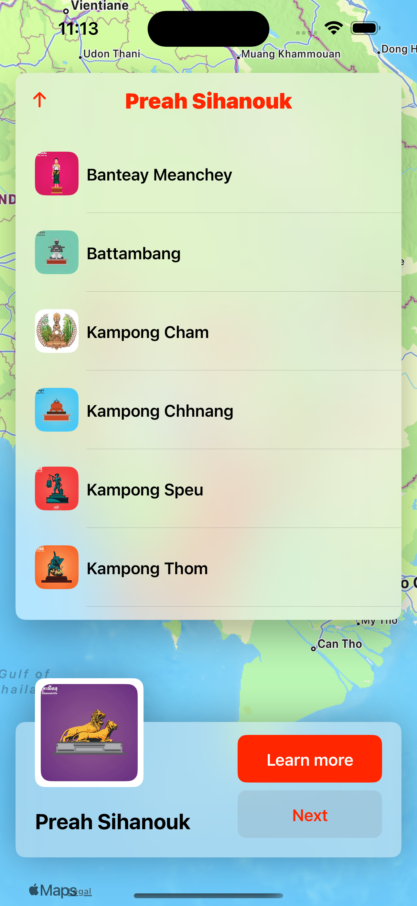
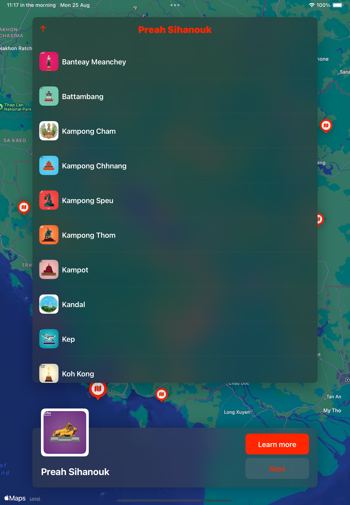
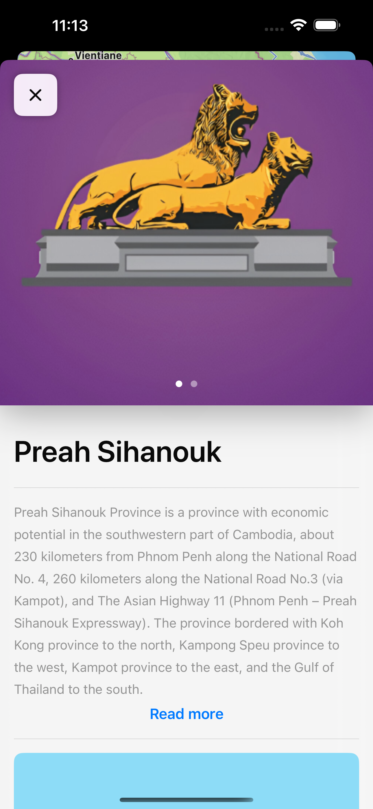
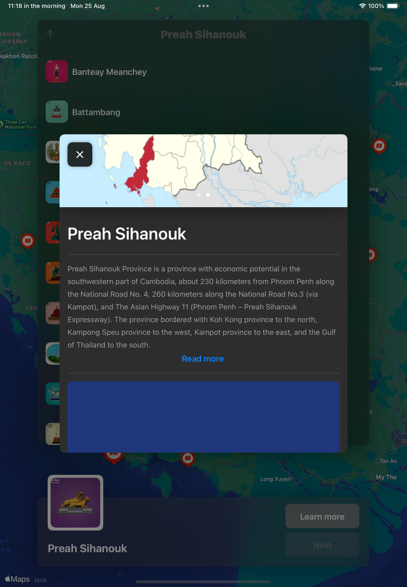

# 🗺️ Map App

This project demonstrates the **Map App** UI across **iPhone (Light Mode)** and **iPad (Dark Mode)**.

## 📱 Screens

| Screen        | iPhone (Light Mode) | iPad (Dark Mode) |
|---------------|---------------------|------------------|
| LaunchScreen  |  |  |
| ViewScreen    |    |    |
| LocationList  |  |  |
| DetailScreen  |  |  |

---

✨ Compare UI differences between **light** (iPhone) and **dark** (iPad) modes.
